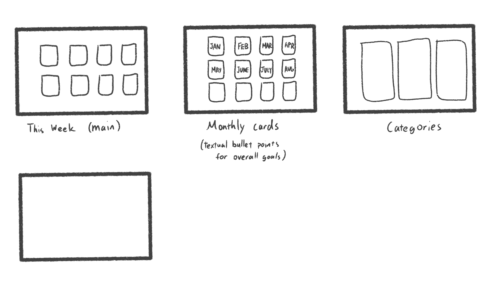

# project-project
Project-project is a project management application.



# project-project project documentation

This is intended to be cloned in oh-my-zsh plugins. After
cloning, run `sh install.sh`.
The project structure looks like this:

```
project-project/
  project-project-vue/
  proj_functions/
    proj.sh
    generate_project.sh
    get_root.py
    linkify.py
    pandaify.py
    seek_root.sh
  demo_proj/
  README.md
  install.sh
```

You can run the todo app from
`project-project-vue`
in web form with `yarn serve`
and in desktop form with `yarn electron:serve` (which will start execution from `backgroud.js`)
Note that both of these commands cause web-pack stuff to happen.

project structure:

```
demo_proj/
  README.md
  wiki/
    src/
    linked/
    html/
  todo/
  progress/
  src/
```

**put this in your zsh file**
`export PROJ_PROJ_PATH="$HOME/Desktop/project-project"`
`alias proj="sh $PROJ_PROJ_PATH/proj_functions/proj.sh"`
**in this order**

This sets up the following aliases to work (all of these except
    generate project work from anywhere inside a project):
- `proj generate [PROJECT NAME]` will generate a project 
- `proj compile` will compile the wiki
- `proj` will open the project interface, which has a wiki viewer, todo viewer + editor

## Basic features

- todo app
  - "better version of trello"
    - categories of tasks 
    - can move stuff with vim keybindings (shift+v for block select, then x, then p)
    - subtasks
  - time categories:
    - "whenever I have free time" / back burner
    - monthly summary
    - weekly summary
    - daily breakdowns, optional time stamps
  - vim text areas: "jakub-m thing on github"
  - markdown
    - "preview mode"
    - text highlighting

- progress indicator
  - finished stuff

- fancy graphics
  - cool color scheme
    - but you can plug in yourr own custom css file if you feel like it
  - random animmations 

- wiki thing
  - e.g. documentation
  * enchanted forest
    - Bob character page. 
      - Bob is a _levancer_. He hates _Malimost_.
      - **Bob is a pro**.

